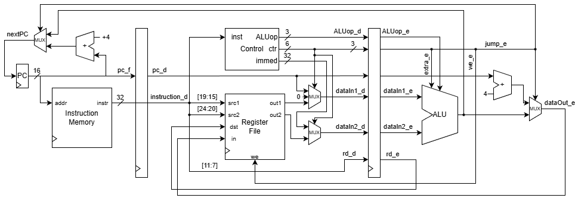

# riscy-5
Implementation of RISC-V in Verilog to prove I'm still worthy.

## Inspiration
After TAing SC2103 (Digital Systems Design) and SC3050 (Advanced Computer Architecture) at NTU, I had an itch to implement the pipeline myself. There, the students were given the code of CPU with 18-bit (yikes) ISA at SC2103 or LEGv8 (LEG, do you get it? Not an ARM but a LEG, haha) at SC3050.

# Implementation Details

Current pipeline structure:



Currently implemented:
- Fetch-decode-execute for instructions:
  - Arithmetic (imm and reg-reg)
  - Jumps

To Do:
- Conditional branches
- Memory
- Data forwarding
- Pipeline stalls (where forwaring is not applicable)
- Pipeline flush (for bad branch predictions)

# Running

## Preparing the Environment

```
sudo apt install make iverilog xxd binutils-riscv64-linux-gnu gtkwave
```

## Running Simulations of Testbenches

To run all simulations in sequence:
```
make sim
```

Individual: `make <component>_sim`, components: `fetch`, `decode`, `execute`, `cpu`.

It compiles the testbench with `iverilog`, runs it to get the waveform file, and opens it in gtkwave.

## Running Test Code

To run all tests in sequence:
```
make tests
```

Individual: `make <testcase>_test`, testcases: `addi`, `reg_imm`, `reg_reg`, `jump`.

To run the test, it compiles the `test/<testcase>.s` into binary that can be used as the init file for instruction memory and runs `cpu_sim`.
